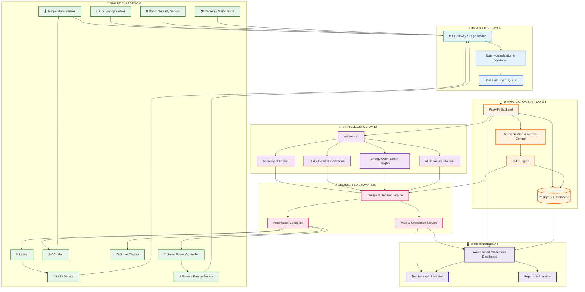
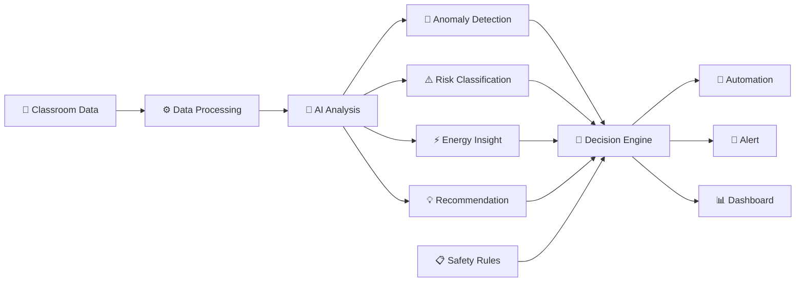

Absolutely. For **AI Smart Classroom Guardian**, your architecture should look much more impressive than the generic template. I’d represent it as a **layered smart-classroom system**: classroom sensors/devices → edge/data layer → AI intelligence → decision/automation → dashboard & alerts.

Since this is your actual architecture documentation, you can **replace the entire current `architecture.md` with the following**:

# 🏗️ AI Smart Classroom Guardian

## System Architecture

AI Smart Classroom Guardian is a smart classroom intelligence platform designed to improve **energy efficiency, safety, security, and automation**.

The system collects classroom information from sensors and connected devices, processes the data through the backend, uses AI to identify abnormal conditions and generate intelligent insights, and then triggers appropriate automation or alerts.



---

## 🧩 Components

| Component             | Technology                 | Responsibility                                                           |
| --------------------- | -------------------------- | ------------------------------------------------------------------------ |
| Classroom Sensors     | IoT / Sensors              | Collect temperature, light, occupancy, energy and security data          |
| Camera / Vision Input | Computer Vision            | Provide visual information for supported classroom monitoring scenarios  |
| IoT Gateway           | Edge Device / IoT Gateway  | Collect and forward classroom telemetry                                  |
| Data Processing       | Python                     | Validate, normalize and prepare incoming data                            |
| Backend API           | FastAPI                    | Business logic, API orchestration and system coordination                |
| AI Intelligence       | IBM watsonx.ai             | Analyze events, identify anomalies and generate intelligent insights     |
| Rule Engine           | Python                     | Apply deterministic safety and automation rules                          |
| Database              | PostgreSQL                 | Store classroom events, sensor readings, alerts and historical analytics |
| Decision Engine       | Python                     | Combine AI insights and predefined rules to determine actions            |
| Automation Controller | IoT / Device APIs          | Control connected classroom devices                                      |
| Dashboard             | React                      | Provide real-time classroom monitoring and analytics                     |
| Authentication        | API Authentication         | Protect user and administrative access                                   |
| Notification Service  | Webhook / Notification API | Deliver important alerts and system notifications                        |

---

## 🔄 Data Flow

The Smart Classroom Guardian follows a continuous **Sense → Analyze → Decide → Act → Learn** workflow.

### 1. Sense

Sensors and connected classroom devices collect information such as:

* 🌡️ Temperature
* 💡 Lighting conditions
* 👥 Classroom occupancy
* ⚡ Energy consumption
* 🔒 Door/security status
* 📷 Supported visual information

### 2. Ingest

The IoT gateway receives classroom telemetry and forwards it to the backend.

```text
Sensors / Devices
       ↓
IoT Gateway
       ↓
Data Validation
       ↓
Event Processing
```

### 3. Analyze

The FastAPI backend processes incoming events and sends relevant information to the AI intelligence layer.

```text
Classroom Event
       ↓
FastAPI Backend
       ↓
watsonx.ai
       ↓
AI Analysis
```

The AI layer can generate:

* Anomaly identification
* Event classification
* Energy-efficiency insights
* Risk indicators
* Recommended actions

### 4. Decide

The Decision Engine combines:

**AI insights + sensor data + predefined safety rules**

to determine whether the system should:

* Continue normal operation
* Optimize classroom devices
* Generate an alert
* Trigger an automated response
* Request administrator attention

### 5. Act

When automation is appropriate, the Automation Controller can interact with connected classroom devices such as:

* Lights
* AC / fans
* Smart displays
* Power controllers

### 6. Alert

Important events are sent to the dashboard and authorized users through the notification service.

```text
Abnormal Event
      ↓
AI Analysis
      ↓
Risk Evaluation
      ↓
Alert Service
      ↓
Teacher / Administrator Dashboard
```

### 7. Monitor & Improve

The system stores events and outcomes in PostgreSQL so the dashboard can provide:

* Real-time status
* Energy trends
* Alert history
* Classroom analytics
* System performance information

---

## 🧠 AI Decision Flow

The AI intelligence layer is designed to work together with deterministic rules rather than replacing them.



This hybrid approach provides a balance between **AI-driven intelligence** and **predictable rule-based safety controls**.

---

## 🔐 Security Considerations

Security is considered across the application architecture.

* API credentials and AI service keys are stored using environment variables or secure secret management.
* Secrets must never be committed to the Git repository.
* Authentication and authorization should be applied to protected API routes.
* Input validation should be performed before processing sensor or user data.
* Database credentials should be stored securely.
* Classroom data should be accessed only by authorized users.
* External integrations should use authenticated and encrypted communication where supported.
* Logs should avoid storing unnecessary sensitive information.
* Device-control operations should be restricted to authorized services and users.

---

## 📊 Database Responsibilities

PostgreSQL can maintain structured historical information such as:

```text
Classroom
   │
   ├── Sensor Readings
   │      ├── Temperature
   │      ├── Occupancy
   │      ├── Light Level
   │      └── Energy Usage
   │
   ├── Events
   │      ├── Normal
   │      ├── Anomaly
   │      └── Security Event
   │
   ├── Alerts
   │      ├── Warning
   │      ├── Critical
   │      └── Resolved
   │
   └── Automation History
          ├── Device
          ├── Action
          └── Timestamp
```

---

## 📈 Scalability Notes

The architecture is designed so individual layers can be scaled independently.

### Backend

The FastAPI backend can remain stateless and be horizontally scaled behind a load balancer.

### AI Layer

AI requests can be processed asynchronously and optimized through batching, caching and controlled request rates.

### Database

PostgreSQL can be scaled using indexing, query optimization, connection pooling and, at larger scale, read replicas or partitioning.

### IoT Layer

Additional classrooms can connect through the same gateway/API architecture without requiring a separate application for every classroom.

### Event Processing

A message broker or streaming platform can be introduced as the number of classrooms and sensor events increases.

### Future Architecture

```text
             ┌──────────────────────┐
             │ Multiple Classrooms  │
             └──────────┬───────────┘
                        ↓
                IoT / Edge Layer
                        ↓
              Event Streaming Layer
                        ↓
               API / Microservices
                  ↙           ↘
             AI Services    Database
                  ↘           ↙
                Decision Engine
                       ↓
              Automation + Alerts
                       ↓
              Unified Dashboard
```

This allows the prototype to evolve from **one smart classroom** into a scalable **multi-classroom or campus-wide intelligent management platform**.

---

## 🚀 Architecture Summary

The AI Smart Classroom Guardian architecture connects the physical classroom with an intelligent software platform:

```text
🏫 CLASSROOM
     ↓
📡 SENSORS & DEVICES
     ↓
⚙️ DATA / EDGE PROCESSING
     ↓
🧠 AI + RULE ENGINE
     ↓
🎯 DECISION ENGINE
     ↓
🤖 AUTOMATION + 🚨 ALERTS
     ↓
🖥️ SMART DASHBOARD
     ↓
📊 ANALYTICS & INSIGHTS
```

### Core Principle

> **Sense → Analyze → Decide → Act → Monitor**

The goal is not simply to make the classroom connected, but to make it **intelligent, efficient, safe and responsive**.

This is **much stronger for a hackathon** than the original architecture because it clearly shows your four major pillars: **⚡ Energy + 🛡️ Safety + 🔒 Security + 🤖 AI Automation**.
