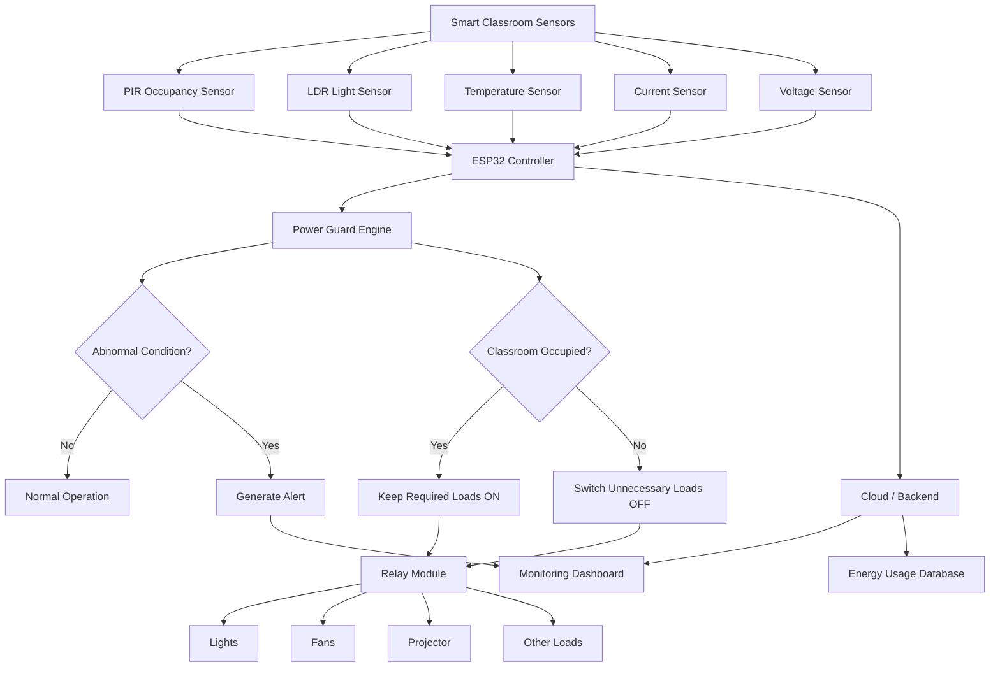

# Solution Overview

## What We Built

We built a **Smart Classroom AI Power Guard** that makes classrooms safer, smarter, and more energy-efficient.

The system monitors classroom electrical equipment such as **lights, fans, projectors, and other appliances**. It checks whether devices are being used normally and detects situations such as **unnecessary power consumption, devices being left ON, abnormal current usage, or possible electrical faults**.

At the same time, the system can monitor classroom conditions such as **temperature, light level, occupancy, and power consumption**. Based on this information, it can automatically control electrical loads and notify the teacher or administrator when something unusual happens.

For example, if the classroom becomes empty while the lights and fans are still running, the Power Guard can detect the situation and switch unnecessary appliances OFF. If abnormal current is detected, the system can immediately disconnect the affected load and generate an alert.

The goal is to create a classroom that **uses less electricity, prevents electrical hazards, and requires less manual monitoring**.

---

## How It Works

1. **Sensors monitor the classroom**

   * Current and voltage sensors measure electrical consumption.
   * PIR/occupancy sensors detect whether people are present.
   * Temperature and light sensors monitor classroom conditions.

2. **The controller collects the data**

   * An ESP32/microcontroller continuously receives sensor readings.
   * It calculates parameters such as current, voltage, power and energy consumption.

3. **Power Guard analyzes the situation**

   * The system compares the readings with predefined safe limits.
   * It identifies conditions such as:

     * Classroom empty but appliances ON
     * Excessive power consumption
     * Over-current
     * Abnormal voltage
     * Appliance operating for an unusually long time

4. **Automatic protection is activated**

   * If a dangerous electrical condition is detected, the controller can turn OFF the affected appliance through a relay.
   * This helps prevent equipment damage and reduces electrical hazards.

5. **Smart energy saving**

   * When no occupants are detected for a predefined period, unnecessary lights and fans can automatically be switched OFF.
   * Appliances can also be controlled according to classroom conditions.

6. **Data is sent to the monitoring dashboard**

   * Important sensor readings are displayed on a dashboard.
   * The user can see classroom occupancy, appliance status and power consumption.

7. **Alerts are generated**

   * When the system detects an abnormal condition, it generates an alert.
   * The alert can identify the problem, affected appliance and recommended action.

8. **Historical data is stored**

   * Power consumption and events can be stored so that administrators can identify inefficient appliances and understand classroom energy usage over time.

---

## Core System Flow

```text
             ┌──────────────────────────┐
             │       SMART CLASSROOM    │
             │                          │
             │  PIR   LDR   Temperature │
             │  Current / Voltage Sensor│
             └────────────┬─────────────┘
                          │
                          ▼
                 ┌─────────────────┐
                 │      ESP32      │
                 │ Sensor + Control│
                 └────────┬────────┘
                          │
              ┌───────────┴───────────┐
              │                       │
              ▼                       ▼
      ┌────────────────┐      ┌────────────────┐
      │  POWER GUARD   │      │   IoT / Cloud  │
      │                │      │    Dashboard   │
      │ Fault Detection│      │                │
      │ Energy Saving  │      │ Live Monitoring│
      │ Load Protection │      │ Data Analytics │
      └───────┬────────┘      └────────────────┘
              │
              ▼
       ┌───────────────┐
       │ Relay Module  │
       └───────┬───────┘
               │
       ┌───────┼────────┐
       ▼       ▼        ▼
     LIGHT    FAN    PROJECTOR
```

---

## Architecture Diagram

> See `architecture.md` for the detailed system architecture.



---

## Key Design Decisions

| Decision                         | Rationale                                                                                                                                    |
| -------------------------------- | -------------------------------------------------------------------------------------------------------------------------------------------- |
| **ESP32 as the main controller** | Provides sufficient processing power, Wi-Fi connectivity and multiple GPIO/ADC interfaces while remaining inexpensive and easy to prototype. |
| **Occupancy-based control**      | Prevents lights and fans from remaining ON when the classroom is empty, directly reducing unnecessary energy consumption.                    |
| **Current + voltage monitoring** | Allows the system to calculate electrical power and identify abnormal electrical conditions.                                                 |
| **Relay-based load control**     | Provides automatic ON/OFF control of classroom appliances based on sensor information and safety rules.                                      |
| **Local safety rules**           | Basic protection decisions can happen directly on the ESP32 so the system does not depend entirely on the internet.                          |
| **Cloud/dashboard monitoring**   | Allows teachers or administrators to monitor classroom status and energy consumption from a central interface.                               |
| **Event-based alerts**           | Instead of constantly sending notifications, the system generates alerts only when important conditions occur.                               |
| **Historical energy data**       | Helps identify high-consumption appliances and measure how much energy the smart system saves.                                               |
| **Modular sensor design**        | Sensors can be added or removed without redesigning the complete system.                                                                     |
| **Fail-safe operation**          | Electrical protection should default to a safe state when a critical fault or communication failure is detected.                             |

---

# IBM Technologies Used

## IBM watsonx.ai

**watsonx.ai** can be used as the intelligence layer of the Power Guard.

Sensor information and historical classroom events can be provided to an AI model to identify unusual patterns and classify events.

For example:

```text
Input:

Occupancy = 0
Light = ON
Fan = ON
Power = 850 W
Duration = 45 minutes

AI/System Result:

Possible Energy-Wasting Event
Reason: Classroom appears empty while high-power loads remain active.
Recommended Action: Turn OFF unnecessary loads.
```

The AI layer can also help classify events into categories such as:

```text
NORMAL
ENERGY_WASTE
OVER_CURRENT
ABNORMAL_VOLTAGE
UNEXPECTED_LOAD
POSSIBLE_FAULT
```

---

## IBM watsonx.data

**watsonx.data** can be used to organize and analyze historical classroom energy information.

Example stored information:

```text
Timestamp
Classroom ID
Occupancy
Voltage
Current
Power
Temperature
Light Status
Fan Status
Projector Status
Alert Type
Energy Consumed
```

This information can be analyzed to answer questions such as:

* Which classroom consumes the most electricity?
* At what time is energy consumption highest?
* Which appliance consumes the most power?
* How much energy was saved by automatic switching?
* How frequently do abnormal electrical events occur?

---

## IBM watsonx Assistant

**watsonx Assistant** can provide a simple conversational interface for teachers or administrators.

Example:

```text
User:
"Is Classroom 204 safe?"

Assistant:
"Classroom 204 is currently operating normally.
Occupancy: 32 students
Power: 1.24 kW
Lights: ON
Fans: ON
No electrical fault detected."
```

Another example:

```text
User:
"Why did Power Guard switch OFF the projector?"

Assistant:
"The projector was switched OFF because the classroom
was detected as unoccupied for the configured timeout period."
```

---

## IBM Cloud

IBM Cloud can be used to host the backend services, APIs, databases and monitoring components required by the system.

The ESP32 can send sensor information to the backend:

```text
ESP32
   ↓
Internet / Wi-Fi
   ↓
IBM Cloud Backend
   ↓
AI + Database
   ↓
Smart Classroom Dashboard
```

---

# Power Guard Decision Logic

The core Power Guard logic can be represented as:

```text
IF classroom = EMPTY
    AND appliance = ON
    AND timeout exceeded
THEN
    turn appliance OFF
    create ENERGY_WASTE alert

IF current > SAFE_CURRENT_LIMIT
THEN
    turn affected load OFF
    create OVER_CURRENT alert

IF voltage < MIN_SAFE_VOLTAGE
    OR voltage > MAX_SAFE_VOLTAGE
THEN
    disconnect protected load
    create VOLTAGE_FAULT alert

IF power consumption > EXPECTED_POWER
THEN
    create ABNORMAL_CONSUMPTION alert

IF sensor values are normal
THEN
    continue normal operation
```

---

# Example Smart Classroom Scenario

Imagine that a classroom has finished its lecture.

The teacher leaves the room, but the **lights, fans and projector remain ON**.

The system detects:

```text
Occupancy = 0
Lights = ON
Fans = ON
Projector = ON
Power = High
```

The Power Guard waits for the configured timeout to avoid switching equipment OFF accidentally.

After the timeout:

```text
Power Guard
     ↓
Classroom Empty
     ↓
Check Appliances
     ↓
Unnecessary Loads Detected
     ↓
Turn OFF Lights
Turn OFF Fans
Turn OFF Projector
     ↓
Record Energy Saved
     ↓
Update Dashboard
```

This transforms the classroom from a manually controlled room into an **automatically managed energy-efficient environment**.

---

# Expected Benefits

### Energy Saving

Automatically switches unnecessary appliances OFF when the classroom is not being used.

### Electrical Safety

Detects abnormal current, voltage and power conditions and can disconnect affected loads.

### Real-Time Monitoring

Teachers and administrators can see classroom conditions and appliance status.

### Predictive/AI Analysis

Historical data can be analyzed to identify unusual consumption patterns.

### Reduced Human Error

The system does not depend completely on someone remembering to switch everything OFF.

### Scalable Architecture

The same system can be expanded from one classroom to an entire school or college.

---

# Final Architecture

```text
                  SMART CLASSROOM
                         │
       ┌─────────────────┼─────────────────┐
       │                 │                 │
     PIR/LDR        Temperature       Power Sensors
       │                 │                 │
       └─────────────────┼─────────────────┘
                         ▼
                    ┌─────────┐
                    │  ESP32  │
                    └────┬────┘
                         │
             ┌───────────┴───────────┐
             ▼                       ▼
       ┌─────────────┐       ┌──────────────┐
       │ POWER GUARD │       │ IBM CLOUD /  │
       │   ENGINE    │       │   BACKEND    │
       └──────┬──────┘       └──────┬───────┘
              │                     │
              ▼                     ▼
        ┌───────────┐        ┌──────────────┐
        │   RELAYS  │        │ AI ANALYSIS  │
        └─────┬─────┘        │ watsonx.ai   │
              │              └──────┬───────┘
       ┌──────┼──────┐              │
       ▼      ▼      ▼              ▼
     LIGHT   FAN  PROJECTOR    ┌─────────────┐
                                │  DATABASE   │
                                └──────┬──────┘
                                       │
                                       ▼
                              ┌─────────────────┐
                              │ SMART DASHBOARD │
                              └─────────────────┘
```

## One-Line Solution

**Smart Classroom AI Power Guard continuously monitors classroom conditions and electrical consumption, automatically controls unnecessary loads, detects abnormal electrical behavior, and uses AI-powered analysis to make classrooms safer and more energy-efficient.**
